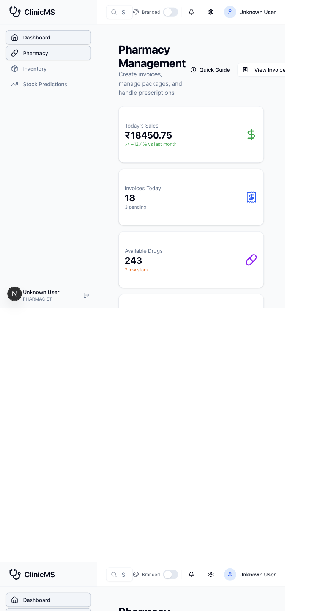
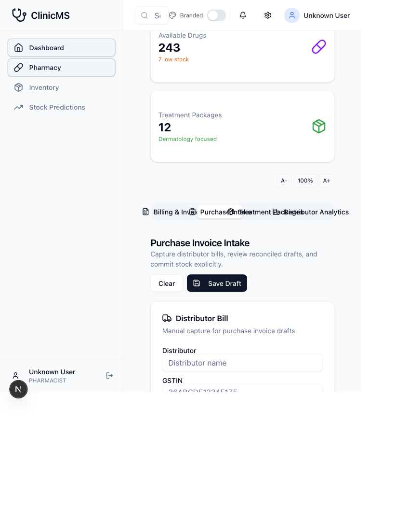
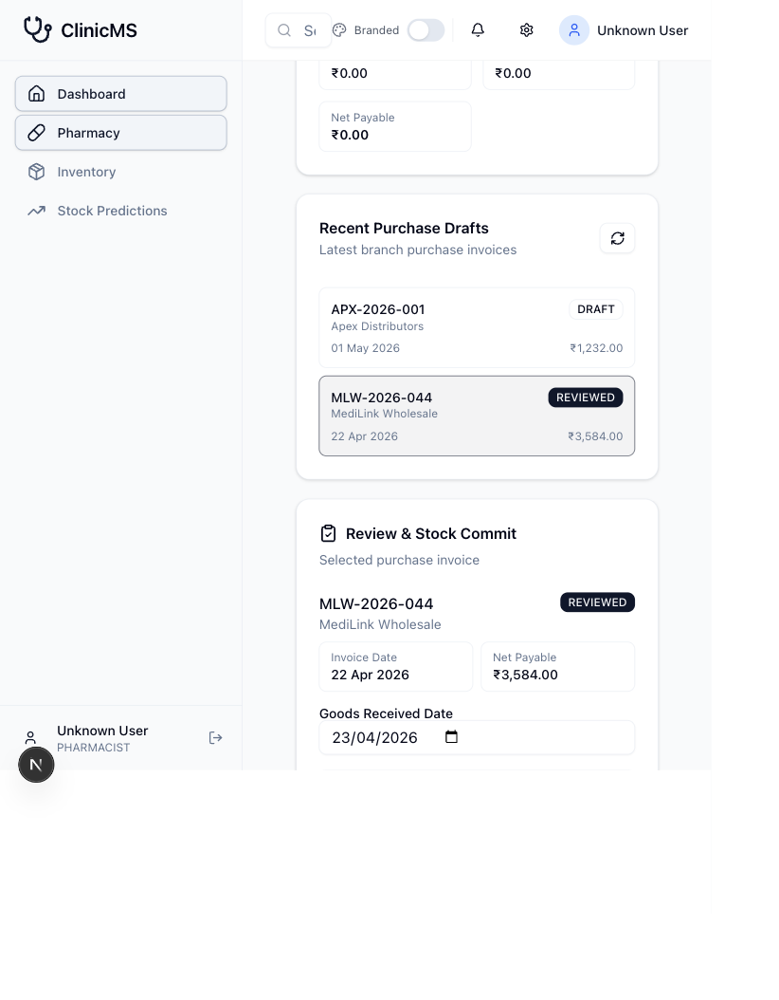
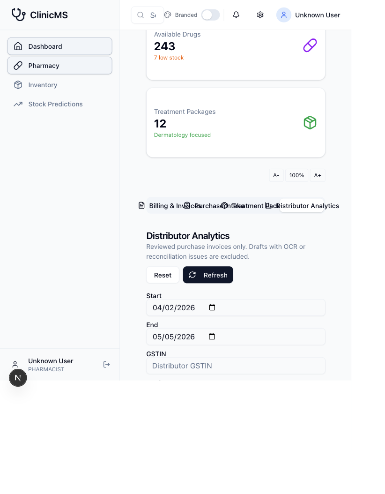
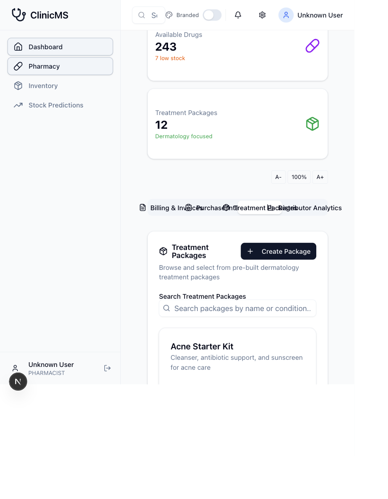

# Pharmacy Section Guide

These screenshots were captured from a local dev session using a mock API. No production database was connected to, migrated, seeded, or modified.

## 1. Pharmacy Dashboard And Billing

The pharmacy dashboard opens on **Billing & Invoices**. The top cards show pharmacy performance for the branch: sales, invoices, drug availability, and treatment package count.

Use this screen to create patient-facing pharmacy invoices:

1. Select or search a patient.
2. Select the doctor when the sale is linked to a prescription or visit.
3. Add individual drugs or package items.
4. Review the invoice summary, billing name, phone, payment method, and notes.
5. Use **Confirm & Print Invoice** to create the invoice, confirm it through the status endpoint, and load standardized print data.

The backend validates item consistency, branch-safe prescription links, status transitions, stock allocation, and print payload shape.

## 2. Purchase Invoice Intake

The **Purchase Intake** tab is for distributor bills. The left side captures the bill header and line items. The right side shows recent purchase invoices and the selected invoice review panel.

Draft capture is defensive:

1. Required header fields include distributor, GSTIN, DL number, invoice number, invoice date, and doctor/registration reference.
2. Credit bills require a due date.
3. Goods received date cannot be before invoice date.
4. Line quantities must be whole numbers and paid plus free quantity must be greater than zero.
5. Line GST, taxable value, line total, and header totals are calculated before submission.
6. OCR flags and reconciliation issues keep the invoice out of review.

## 3. Review And Stock Commit

Stock is not committed when a draft is created. A purchase invoice must first be clean and reviewed. Once selected invoice status is **REVIEWED**, **Commit Stock** becomes available.

Commit behavior is explicit and guarded:

1. Only reviewed invoices can be committed.
2. Expired batches are blocked.
3. Product master matching must be exact and complete.
4. Existing batches are incremented; new batches are created only after validation.
5. The commit is idempotent and records a stock commit reference.
6. Free quantity is valued using effective unit cost across paid plus free stock.

## 4. Distributor Analytics

The **Distributor Analytics** tab uses reviewed and stock-committed purchase invoices only. Drafts, OCR-review invoices, and reconciliation-failed invoices are excluded.

Use filters for:

- Date range
- Distributor GSTIN
- Product name
- HSN code
- Minimum discount-drop percentage

The tables show distributor ranking, product effective cost, and discount-drop alerts. Effective cost includes free units, so scheme-driven purchase value is easier to compare.

## 5. Treatment Packages

The **Treatment Packages** tab lists reusable dermatology packages. Packages can be searched, viewed, and selected for invoice creation.

Packages show:

- Package price versus original price
- Discount percentage
- Included item count
- Duration
- Creator
- Public/private visibility

Package billing flows through the same invoice validation path as drug billing, so item type and item ID consistency are enforced.

## Related Screens

- **View Invoices** opens the pharmacy invoice list for confirmed, draft, and paid invoice tracking.
- **Manage Drugs** opens the drug master. Active drugs now require composition, category, dosage form, and strength, and the alternatives endpoint only returns exact-composition in-stock substitutes.

## Verification Covered

- Frontend purchase intake tests
- Frontend distributor analytics tests
- Backend pharmacy invoice tests
- Backend purchase invoice tests
- Backend build
- Frontend build
- Prisma schema validation with a dummy database URL
- Migration ignore-rule check
